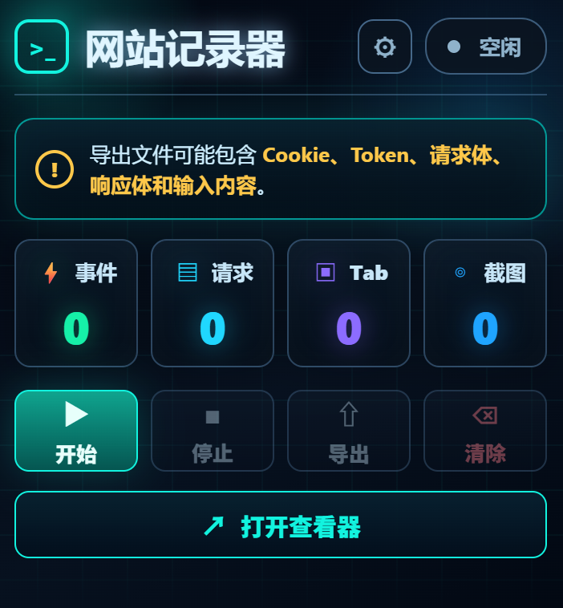
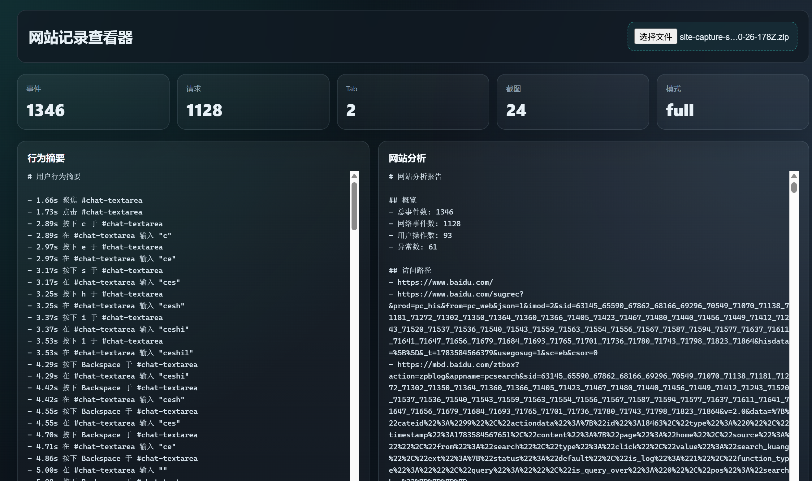

# Site Capture Analyzer

[简体中文](./README.md) | English

Site Capture Analyzer is a local Chrome/Edge extension for recording website analysis sessions. It captures page state, user actions, navigation changes, storage, cookies, network metadata, page-visible request/response bodies, screenshots, and exports everything as a local ZIP package.

> Security warning: exported files may contain cookies, tokens, request bodies, response bodies, screenshots, and typed input. Use and share exports only in trusted environments.

## Screenshots

### Extension Popup



### Export Viewer



## Features

- Record page snapshots and DOM mutations.
- Capture user actions such as clicks, input, scroll, focus, paste, submit, and key events.
- Capture network request/response metadata and page-visible fetch/XHR bodies.
- Capture `localStorage`, `sessionStorage`, and cookies.
- Track navigation and tabs opened from a recorded page.
- Capture screenshots during key moments.
- Export a ZIP package with timeline, network, DOM, storage, behavior summary, site analysis, and screenshots.
- Built-in viewer page for exported data.
- Configurable full/redacted export modes.
- Configurable auto-stop protection: maximum duration, event count, screenshot count, and idle timeout.
- Toolbar icon changes while recording.

## Development Install

```bash
pnpm install
pnpm build
```

Then open `chrome://extensions/`, enable Developer mode, choose "Load unpacked", and select the `dist` directory.

After source changes, rebuild:

```bash
pnpm build
```

Then refresh the extension in `chrome://extensions/`.

## Usage

1. Open the target website.
2. Click the extension icon.
3. Click `开始` to start recording.
4. Perform the actions you want to analyze.
5. Click `停止`, or let auto-stop protection stop recording.
6. Click `导出` to download the ZIP package.
7. Click `打开查看器` to inspect an export.

Use the gear icon in the popup to configure:

- Export mode: full or redacted.
- Maximum recording duration.
- Maximum event count.
- Maximum screenshot count.
- Idle auto-stop timeout.

## Export Contents

A typical export contains:

- `manifest.json`
- `timeline.jsonl`
- `network.jsonl`
- `dom-snapshots.jsonl`
- `user-actions.jsonl`
- `storage.json`
- `screenshots.jsonl`
- `screenshots/*.png`
- `ai-summary.md`
- `behavior-summary.md`
- `site-analysis.md`

## Security And Privacy

This project is intentionally powerful and can collect sensitive data. Read [PRIVACY.md](./PRIVACY.md) and [SECURITY.md](./SECURITY.md) before using or contributing.

Do not commit real capture exports, screenshots, cookies, tokens, request bodies, response bodies, or storage dumps. The `.gitignore` excludes common export paths, but you are still responsible for reviewing changes before publishing.

## Development

```bash
pnpm typecheck
pnpm test
pnpm build
pnpm test:e2e
```

`pnpm test:e2e` launches Chrome and loads the built extension from `dist`.

## Community

This project is published and discussed on [Linux.do](https://linux.do/)—[a sincere, friendly, united, and professional community for technical exchange](https://linux.do/).

## License

MIT. See [LICENSE](./LICENSE).
